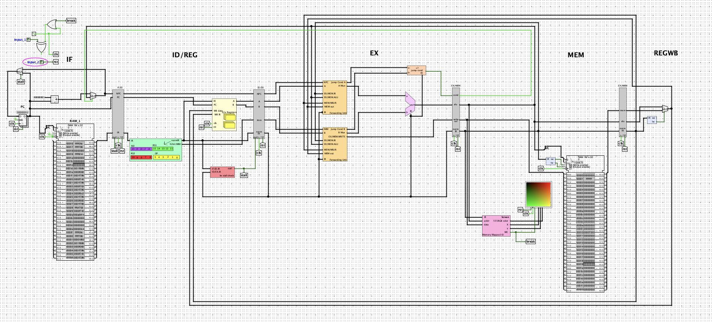

This is a processor I created so that I can follow along with some of the concepts in `Computer Architecture: A Quantitative Approach` by John Hennessy and David Patterson. I have also put together a simple ISA (described in `ISA attempt rriscv.xlsx`) and assembler, VM Byte language, and higher level language to go along with it.

The processor was created in `Logisim` and is in the `rrisc` subcircuit of the `adders.circ` file (this was just a file I had been using for a long time, anything before the `rrisc` subcircuit was not a part of this project).

_Current state of the processor, the screen is displaying a gradient with green on y and red on x_

_Current state of the ISA as of 4/4/2026 from `ISA attempt rriscv.xlsx`_

The stack based VM byte code was based on the one in the `nand2tetris` series with some slight differences and with a different hardware level implementation and memory layout (as the hardware and assembler was developed independently of the series). A custom object oriented higher level language which I have called `rubellite` (cheap version of rubies, lightly based off the `ruby` language), which will compile down to the bytecode language has also been developed. I has always wanted to write a full compiler with tokenization, parsing, ASTs, assembly code, machine code, etc. and needing some code to test the processor with was a good excuse to develop one. 

## Processor/assembler features:

- 32 bit
- 5 stage pipeline (IF, ID, EX, MEM, WB)
- 32 registers
- 28 implemented opcodes (up to 64)
- 4 instruction formats
- Register forwarding/bypassing
- Memory mapped IO (currently just a screen)

Descriptions of op-codes and registers can be found in `ISA attempt rriscv.xlsx`. There are only two types of instrucions, being the one listed in that spreadsheet and one which merges the imm and rd fields into an immRD field which is just a longer immediate (this is subject to change, I will probably add more).

The assembler uses the same format for instruction parameters defined in the spreadsheet. 

## VM compiler features:

- Push/pop operations to work on the stack
- temp, static, result, local, argument, ptr1, and ptr2 segments in memory that push/pop can use
    - ptr1 and ptr2 segment adresses can be set with `pop pointer` `0`/`1` and allow for popping to arbitrary memory locations (heap eventually)
- Labels, conditional label jumps
- Functions, calls, returns

## Rubellite programming language features:

- Classes
- Fields, static, and local variables
- Methods and static functions
- If (else) statements, while statements
- Expression parseing (no order of operations yet though)
- Comments
- Basic heap management (will be improved)

_no AI generated code was used in this project as I enjoy my slightly poorly written code more_

## devlog

Update #1: Forwarding/bypassing has been added.

Update #2: `rriscvmcompiler.py` contains the start of a compiler for a stack based byte code language. Currently only `push (segment) (index)`, `pop (segment) (index)`, and basic arithmetic operations are implemented. This will be based off of the language used in the `nand2tetris` lecture notes.

Update #3: added `label`, `goto`, `if-goto` (pops top of stack and checks if it should jump) to byte language. At some point, I may restructure the way instructions are defined to allow for bigger fields when the others are not needed (other than just immRD).

Updte #4: added `function`, `call`, and `return` along with logic for the call stack. Memory layout documented in the spreadsheet.

Update #5: This took a lot longer than expected but I have began writing my own Object Oriented language to compile down to the bytecode language. Its syntax is very vaguely based on `ruby` and I have it called `rubellite` (a gem which is known as a cheaper version of a ruby) with the file extension `rbl`. So far I have defined the grammer (currently LL(3)), created a tokenizer and parser which gets it to an AST and am going to began working on the compiler. The choice to go with an Object Oriented language was made as the VM I put together based on the one from the `nand2tetris` project is only really designed to be able to push one value onto the stack at the time, so any implementation of structs would just be working on pointers to structs, and at that point there's really no reason not to just have objects. This will also allow me to base the OS somewhat on the one from `nand2tetris` as they also use a custom object oriented language (although they skip AST generation which I found odd) and I have no prior experience with operating systems and some guidence would be nice. Also I renamed the `this` and `that` sections in the bytecode language to `ptr1` and `ptr2` as I found those to be more intuitive. Other minor hardware fixes.

Update #6: Compiler is working!! (as far as I know) It can compile really big programs without throwing error and was able to create a successful n-th term fibonacci calculator with three nested functions (`System$Ini()`, `Main$main()`, `Main$fib(int amount)`) and a while loop.

Update #7: Reworked the ISA to allow for 4 different instruction formats so I can have longer immediates.

Update #8: Implemented basic memory mapped IO and added a screen with a small demo.
